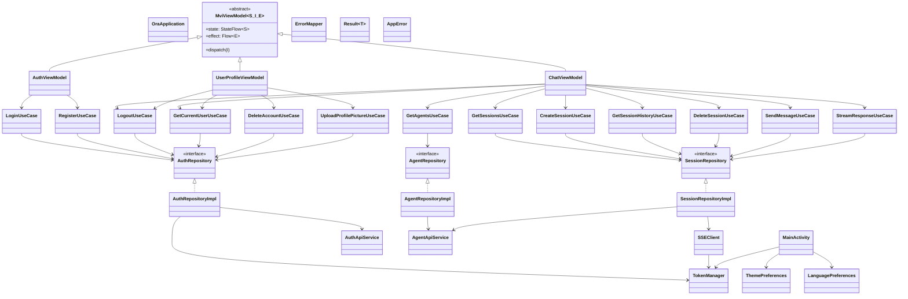

# Ora - Architecture Diagram

```mermaid
classDiagram
    direction TB

    class MainActivity
    class OraApplication

    class AuthViewModel
    class ChatViewModel
    class UserProfileViewModel

    class MviViewModel~S_I_E~ {
        <<abstract>>
        +state: StateFlow~S~
        +effect: Flow~E~
        +dispatch(I)
    }

    class LoginUseCase
    class RegisterUseCase
    class LogoutUseCase
    class GetCurrentUserUseCase
    class DeleteAccountUseCase
    class UploadProfilePictureUseCase
    class GetAgentsUseCase
    class GetSessionsUseCase
    class CreateSessionUseCase
    class GetSessionHistoryUseCase
    class DeleteSessionUseCase
    class SendMessageUseCase
    class StreamResponseUseCase

    class AuthRepository {
        <<interface>>
    }
    class AgentRepository {
        <<interface>>
    }
    class SessionRepository {
        <<interface>>
    }

    class AuthRepositoryImpl
    class AgentRepositoryImpl
    class SessionRepositoryImpl

    class AuthApiService
    class AgentApiService
    class SSEClient

    class TokenManager
    class ThemePreferences
    class LanguagePreferences
    class ErrorMapper
    class Result~T~
    class AppError

    MviViewModel <|-- AuthViewModel
    MviViewModel <|-- ChatViewModel
    MviViewModel <|-- UserProfileViewModel

    AuthViewModel --> LoginUseCase
    AuthViewModel --> RegisterUseCase
    ChatViewModel --> GetAgentsUseCase
    ChatViewModel --> GetSessionsUseCase
    ChatViewModel --> CreateSessionUseCase
    ChatViewModel --> GetSessionHistoryUseCase
    ChatViewModel --> DeleteSessionUseCase
    ChatViewModel --> SendMessageUseCase
    ChatViewModel --> StreamResponseUseCase
    ChatViewModel --> LogoutUseCase
    ChatViewModel --> GetCurrentUserUseCase
    UserProfileViewModel --> GetCurrentUserUseCase
    UserProfileViewModel --> DeleteAccountUseCase
    UserProfileViewModel --> LogoutUseCase
    UserProfileViewModel --> UploadProfilePictureUseCase

    LoginUseCase --> AuthRepository
    RegisterUseCase --> AuthRepository
    LogoutUseCase --> AuthRepository
    GetCurrentUserUseCase --> AuthRepository
    DeleteAccountUseCase --> AuthRepository
    UploadProfilePictureUseCase --> AuthRepository
    GetAgentsUseCase --> AgentRepository
    GetSessionsUseCase --> SessionRepository
    CreateSessionUseCase --> SessionRepository
    GetSessionHistoryUseCase --> SessionRepository
    DeleteSessionUseCase --> SessionRepository
    SendMessageUseCase --> SessionRepository
    StreamResponseUseCase --> SessionRepository

    AuthRepository <|.. AuthRepositoryImpl
    AgentRepository <|.. AgentRepositoryImpl
    SessionRepository <|.. SessionRepositoryImpl

    AuthRepositoryImpl --> AuthApiService
    AuthRepositoryImpl --> TokenManager
    AgentRepositoryImpl --> AgentApiService
    SessionRepositoryImpl --> AgentApiService
    SessionRepositoryImpl --> SSEClient

    SSEClient --> TokenManager

    MainActivity --> TokenManager
    MainActivity --> ThemePreferences
    MainActivity --> LanguagePreferences
```
