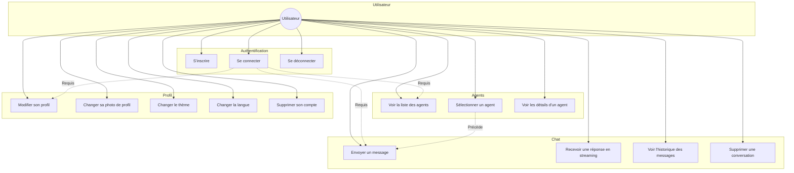
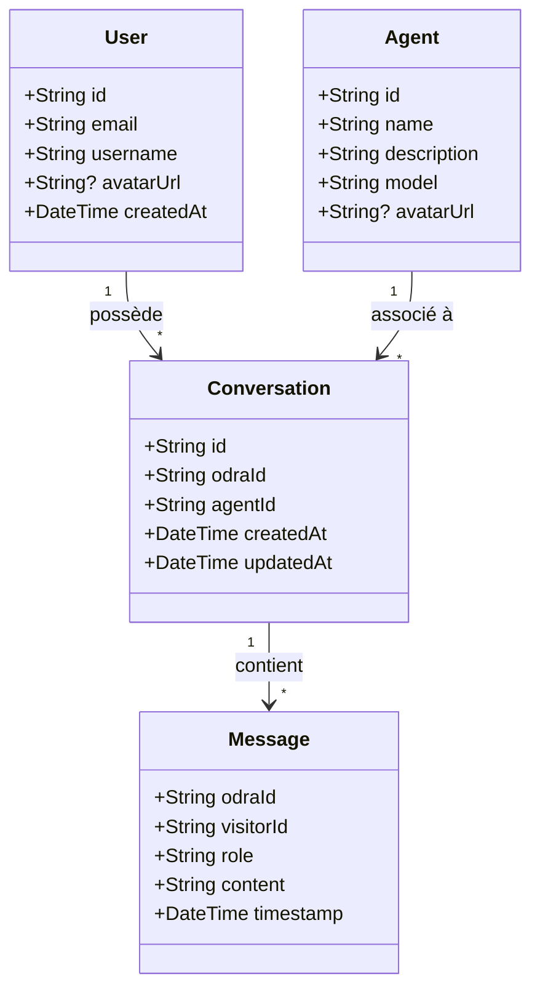

# Spécifications Fonctionnelles - Ora

**Module** : II.3510 Mobile Development in Android
**Année** : 2025-2026
**Date de soutenance** : 21/01/2026


---

## 1. Informations Projet

| Propriété | Valeur |
|-----------|--------|
| **Nom du projet** | Ora |
| **Membres** | Louis Grignola, Amaury Allemand |
| **GitHub Frontend** | https://github.com/grignolalouis/Ora-mobile/ |

---

## 2. Description du Projet

### 2.1 Contexte

Ora est une plateforme permettant d'interagir avec des agents IA conversationnels. Le projet se compose de deux parties :

- **Frontend Mobile** : Application Android native en Kotlin (objet de ce rapport)
- **Backend** : API en Go avec architecture hexagonale

### 2.2 Vision

L'objectif d'Ora est de fournir un **boilerplate maintenable et évolutif** pour construire des systèmes d'interaction avec des agents IA. La plateforme est conçue pour être :

- **Agnostique** : Compatible avec différents types d'agents (LLM, assistants spécialisés, etc.)
- **Modulaire** : Chaque agent possède son propre scope et n'interfère pas avec les autres
- **Flexible** : Permet de définir des agents du plus simple au plus complexe
- **Scalable** : Architecture pensée pour évoluer selon les besoins

### 2.3 Public Cible

- Développeurs souhaitant intégrer des agents IA dans leurs applications
- Entreprises cherchant une solution de chat IA personnalisable
- Utilisateurs finaux interagissant avec des assistants virtuels

### 2.4 Fonctionnalités Principales

| Fonctionnalité | Description |
|----------------|-------------|
| **Authentification** | Inscription, connexion, gestion de session avec JWT |
| **Catalogue d'agents** | Liste des agents disponibles avec descriptions |
| **Chat temps réel** | Conversation avec streaming SSE des réponses |
| **Historique** | Persistance des conversations par agent |
| **Profil utilisateur** | Gestion du compte, photo de profil, préférences |
| **Thème** | Support mode clair/sombre |
| **Multilingue** | Interface en 3 langues (FR, EN, ES) |

---

## 3. Architecture Globale

```
┌─────────────────────────────────────────────────────────────────┐
│                        FRONTEND MOBILE                          │
│                    (Kotlin + Jetpack Compose)                   │
└─────────────────────────────────────────────────────────────────┘
                                │
                                │ HTTPS / SSE
                                ▼
┌─────────────────────────────────────────────────────────────────┐
│                          BACKEND GO                             │
│                   (Architecture Hexagonale)                     │
│                      Framework: tRPC Agent                      │
├─────────────────────────────────────────────────────────────────┤
│  ┌──────────┐  ┌──────────┐  ┌──────────┐  ┌──────────┐        │
│  │ Agent 1  │  │ Agent 2  │  │ Agent 3  │  │ Agent N  │        │
│  │ (Simple) │  │ (Complex)│  │   ...    │  │   ...    │        │
│  └──────────┘  └──────────┘  └──────────┘  └──────────┘        │
└─────────────────────────────────────────────────────────────────┘
                                │
                ┌───────────────┼───────────────┐
                ▼               ▼               ▼
        ┌──────────┐    ┌──────────┐    ┌──────────┐
        │ Postgres │    │  Redis   │    │  Minio   │
        │  (Data)  │    │ (Cache)  │    │ (Files)  │
        └──────────┘    └──────────┘    └──────────┘
                                │
                                ▼
                        ┌──────────┐
                        │ Phoenix  │
                        │ (Traces) │
                        └──────────┘
```

---

## 4. Diagramme de Cas d'Utilisation



---

## 5. Diagramme de Classes

Le diagramme de classes complet est disponible dans :
- `docs/architecture/diagrams/class-diagram.md`
- `docs/architecture/diagrams/architecture-diagram.md` (version simplifiée)

### Vue simplifiée des entités principales



---

## 6. Captures d'Écran

> **Note** : Ajouter les captures d'écran de l'application

### 6.1 Authentification

#### Écran de Connexion


**Description** : L'écran de connexion permet à l'utilisateur de s'authentifier avec son email et mot de passe. Un lien vers l'inscription est disponible en bas de l'écran.

#### Écran d'Inscription


**Description** : Formulaire d'inscription avec validation en temps réel des champs (email valide, mot de passe sécurisé, confirmation).

---

### 6.2 Page d'Accueil - Catalogue d'Agents


**Description** : Liste des agents disponibles sous forme de cartes. Chaque carte affiche le nom, la description et l'avatar de l'agent. Un clic ouvre la conversation avec l'agent sélectionné.

---

### 6.3 Chat avec Streaming


**Description** : Interface de conversation avec un agent. Les messages de l'utilisateur apparaissent à droite (bulles colorées), les réponses de l'agent à gauche. Le streaming SSE permet d'afficher la réponse en temps réel, token par token.

#### Indicateur de réflexion


**Description** : Pendant que l'agent "réfléchit", un indicateur animé informe l'utilisateur que le traitement est en cours.

---

### 6.4 Profil Utilisateur


**Description** : Page de profil permettant de :
- Modifier les informations personnelles (username, email)
- Changer la photo de profil
- Sélectionner le thème (clair/sombre/système)
- Changer la langue de l'interface
- Se déconnecter ou supprimer son compte

---

### 6.5 Thème Sombre


**Description** : L'application supporte un thème sombre complet, appliqué à tous les écrans et composants.

---

## 7. Défis Techniques Surmontés

Les défis techniques majeurs rencontrés lors du développement sont documentés en détail dans `docs/tech-spec/TECHNICAL_CHALLENGES.md`.

### Résumé des défis

| Défi | Complexité | Solution |
|------|------------|----------|
| **Streaming SSE temps réel** | Haute | Buffering avec debounce, StateFlow avec conflate |
| **Rendu Markdown custom** | Haute | Markwon + SyntaxHighlighter custom avec cache LRU |
| **Architecture MVI streaming** | Moyenne | États composites avec sous-états indépendants |
| **Auth avec refresh token** | Moyenne | AuthInterceptor avec Mutex pour éviter race conditions |
| **Intégration OkHttp/Ktor** | Moyenne | Module Hilt partagé, factory commune |

### Exemple : Streaming SSE

Le streaming des réponses IA nécessite une gestion fine du cycle de vie Android. Les événements arrivent à haute fréquence (plusieurs par seconde) et doivent mettre à jour l'UI sans la bloquer.

```kotlin
// Solution : Buffering avec limitation de fréquence
private val _messageBuffer = StringBuilder()

fun onDelta(token: String) {
    _messageBuffer.append(token)
    if (shouldEmit()) {
        _state.update { it.copy(streamingContent = _messageBuffer.toString()) }
    }
}
```

---

## 8. Évolutions Futures

| Fonctionnalité | Priorité | Description |
|----------------|----------|-------------|
| Mode hors-ligne | Haute | Cache local avec Room pour consultation sans connexion |
| Notifications push | Moyenne | Alertes lors de nouvelles réponses d'agents |
| Partage de conversations | Basse | Export PDF/partage de conversations |
| Agents personnalisés | Basse | Création d'agents custom par l'utilisateur |

---

## Annexes

- [Documentation Technique Complète](../README.md)
- [Stack Technique](../TECH_STACK.md)
- [Architecture](../architecture/README.md)
- [Défis Techniques](../tech-spec/TECHNICAL_CHALLENGES.md)
