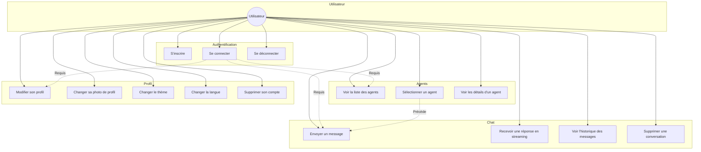
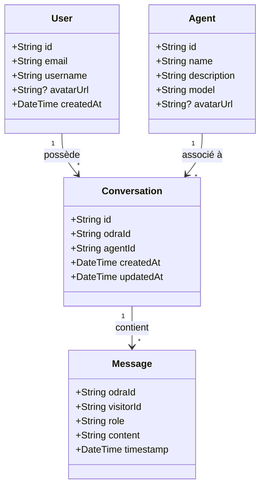
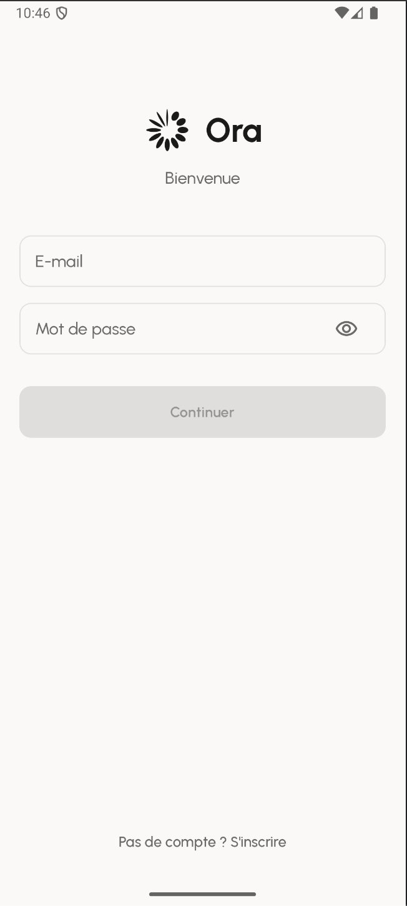
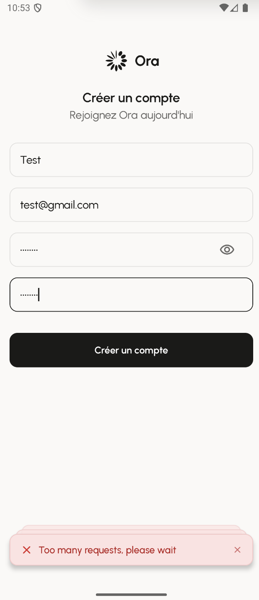
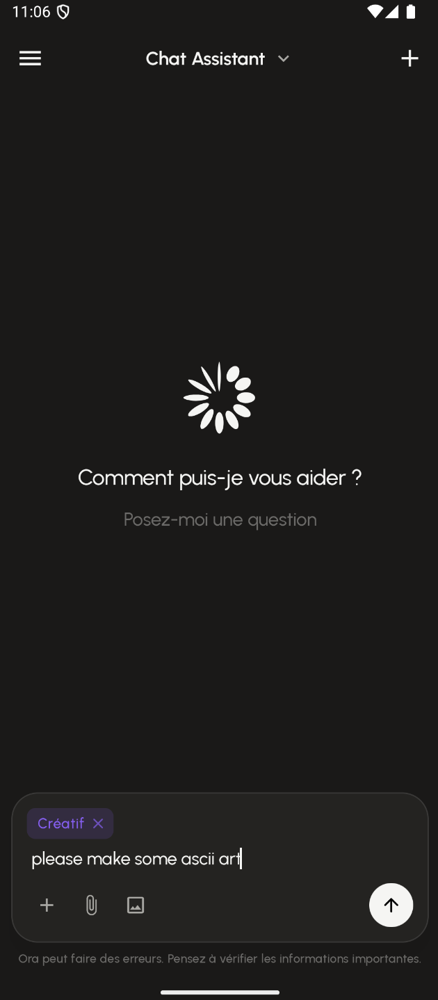
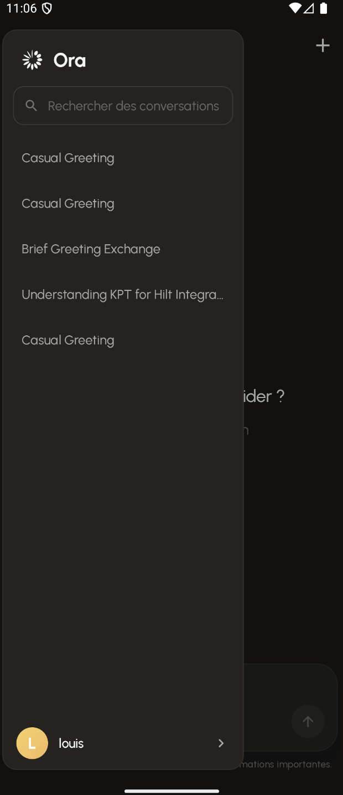
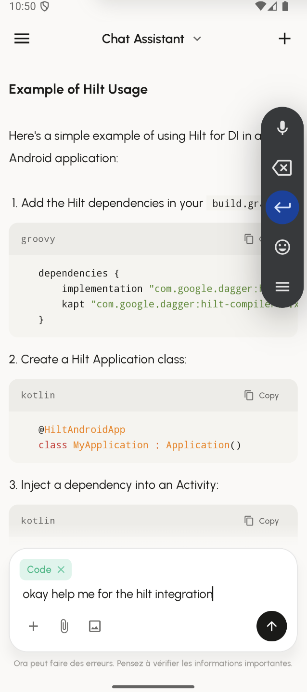
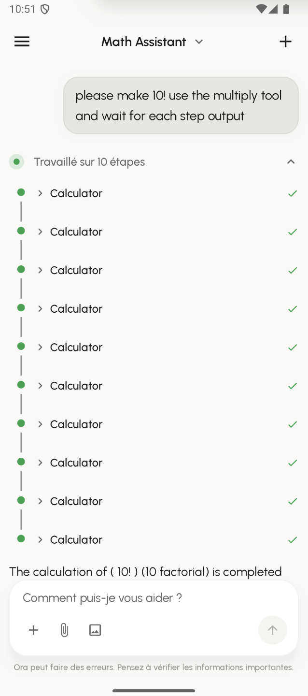
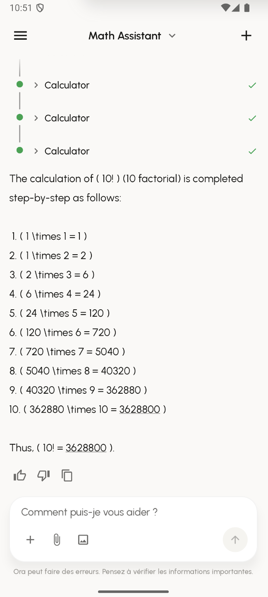
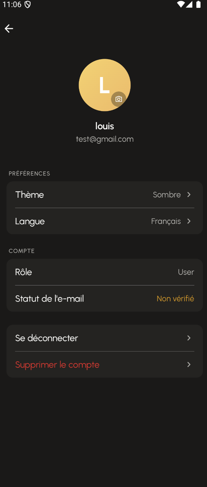

# Spécifications Fonctionnelles - Ora

**Module** : II.3510 Mobile Development in Android
**Année** : 2025-2026
**Date de soutenance** : 21/01/2026


---

## 1. Informations Projet

| Propriété | Valeur |
|-----------|--------|
| **Nom du projet** | Ora |
| **Membres** | Louis Grignola, Amaury Allemand |
| **GitHub Frontend** | https://github.com/grignolalouis/Ora-mobile/ |

---

## 2. Description du Projet

### 2.1 Contexte

Ora est une plateforme permettant d'interagir avec des agents IA conversationnels. Le projet se compose de deux parties :

- **Frontend Mobile** : Application Android native en Kotlin (objet de ce rapport)
- **Backend** : API en Go avec architecture hexagonale

### 2.2 Vision

L'objectif d'Ora est de fournir un **boilerplate maintenable et évolutif** pour construire des systèmes d'interaction avec des agents IA. La plateforme est conçue pour être :

- **Agnostique** : Compatible avec différents types d'agents (LLM, assistants spécialisés, etc.)
- **Modulaire** : Chaque agent possède son propre scope et n'interfère pas avec les autres
- **Flexible** : Permet de définir des agents du plus simple au plus complexe
- **Scalable** : Architecture pensée pour évoluer selon les besoins

### 2.3 Public Cible

- Développeurs souhaitant intégrer des agents IA dans leurs applications
- Entreprises cherchant une solution de chat IA personnalisable
- Utilisateurs finaux interagissant avec des assistants virtuels

### 2.4 Fonctionnalités Principales

| Fonctionnalité | Description |
|----------------|-------------|
| **Authentification** | Inscription, connexion, gestion de session avec JWT |
| **Catalogue d'agents** | Liste des agents disponibles avec descriptions |
| **Chat temps réel** | Conversation avec streaming SSE des réponses |
| **Historique** | Persistance des conversations par agent |
| **Profil utilisateur** | Gestion du compte, photo de profil, préférences |
| **Thème** | Support mode clair/sombre |
| **Multilingue** | Interface en 3 langues (FR, EN, ES) |

---

## 3. Architecture Globale

```
┌─────────────────────────────────────────────────────────────────┐
│                        FRONTEND MOBILE                          │
│                    (Kotlin + Jetpack Compose)                   │
└─────────────────────────────────────────────────────────────────┘
                                │
                                │ HTTPS / SSE
                                ▼
┌─────────────────────────────────────────────────────────────────┐
│                          BACKEND GO                             │
│                   (Architecture Hexagonale)                     │
│                      Framework: tRPC Agent                      │
├─────────────────────────────────────────────────────────────────┤
│  ┌──────────┐  ┌──────────┐  ┌──────────┐  ┌──────────┐        │
│  │ Agent 1  │  │ Agent 2  │  │ Agent 3  │  │ Agent N  │        │
│  │ (Simple) │  │ (Complex)│  │   ...    │  │   ...    │        │
│  └──────────┘  └──────────┘  └──────────┘  └──────────┘        │
└─────────────────────────────────────────────────────────────────┘
                                │
                ┌───────────────┼───────────────┐
                ▼               ▼               ▼
        ┌──────────┐    ┌──────────┐    ┌──────────┐
        │ Postgres │    │  Redis   │    │  Minio   │
        │  (Data)  │    │ (Cache)  │    │ (Files)  │
        └──────────┘    └──────────┘    └──────────┘
                                │
                                ▼
                        ┌──────────┐
                        │ Phoenix  │
                        │ (Traces) │
                        └──────────┘
```

---

## 4. Diagramme de Cas d'Utilisation



---

## 5. Diagramme de Classes

Le diagramme de classes complet est disponible dans :
- `docs/architecture/diagrams/class-diagram.md`
- `docs/architecture/diagrams/architecture-diagram.md` (version simplifiée)

### Vue simplifiée des entités principales



---

## 6. Captures d'Écran

### 6.1 Authentification

#### Écran de Connexion


**Description** : Écran de connexion avec champs email et mot de passe. Design épuré avec le logo Ora. Un lien vers l'inscription est disponible pour les nouveaux utilisateurs.

#### Écran d'Inscription


**Description** : Formulaire d'inscription complet avec validation en temps réel des champs (email valide, mot de passe sécurisé, confirmation du mot de passe).

---

### 6.2 Page d'Accueil



**Description** : Page d'accueil affichant le catalogue des agents disponibles. Chaque agent est présenté sous forme de carte avec son nom, sa description et son icône. L'utilisateur peut sélectionner un agent pour démarrer une conversation.

---

### 6.3 Navigation - Sidebar



**Description** : Menu latéral (drawer) permettant de naviguer entre les différentes sections de l'application. Affiche l'historique des conversations et permet d'accéder rapidement aux agents précédemment utilisés.

---

### 6.4 Interface de Chat

#### Zone de saisie


**Description** : Zone de saisie du message avec bouton d'envoi. L'interface est optimisée pour une saisie rapide et intuitive.

#### Conversation avec l'agent


**Description** : Interface de conversation complète. Les messages de l'utilisateur apparaissent à droite, les réponses de l'agent à gauche. Le rendu Markdown est supporté avec coloration syntaxique pour les blocs de code.

#### Indicateur de réflexion


**Description** : Pendant le traitement de la requête, un indicateur de "réflexion" animé informe l'utilisateur que l'agent analyse sa demande. Le contenu de la réflexion peut être affiché de manière optionnelle.

---

### 6.5 Appels d'Outils (Tool Calls)

#### Exécution des outils


**Description** : Affichage des appels d'outils effectués par l'agent. L'interface montre les outils invoqués avec leurs paramètres, permettant à l'utilisateur de comprendre les actions entreprises par l'agent.

#### Résultat avec réponse


**Description** : Affichage combiné des appels d'outils et de la réponse finale de l'agent. Les résultats des outils sont intégrés de manière cohérente dans le flux de conversation.

---

### 6.6 Profil Utilisateur



**Description** : Page de profil utilisateur permettant de :
- Visualiser et modifier les informations personnelles (username, email)
- Changer la photo de profil
- Sélectionner le thème (clair/sombre/système)
- Changer la langue de l'interface (FR, EN, ES)
- Se déconnecter ou supprimer son compte

---

## 7. Défis Techniques Surmontés

Les défis techniques majeurs rencontrés lors du développement sont documentés en détail dans `docs/tech-spec/TECHNICAL_CHALLENGES.md`.

### Résumé des défis

| Défi | Complexité | Solution |
|------|------------|----------|
| **Streaming SSE temps réel** | Haute | Buffering avec debounce, StateFlow avec conflate |
| **Rendu Markdown custom** | Haute | Markwon + SyntaxHighlighter custom avec cache LRU |
| **Architecture MVI streaming** | Moyenne | États composites avec sous-états indépendants |
| **Auth avec refresh token** | Moyenne | AuthInterceptor avec Mutex pour éviter race conditions |
| **Intégration OkHttp/Ktor** | Moyenne | Module Hilt partagé, factory commune |

### Exemple : Streaming SSE

Le streaming des réponses IA nécessite une gestion fine du cycle de vie Android. Les événements arrivent à haute fréquence (plusieurs par seconde) et doivent mettre à jour l'UI sans la bloquer.

```kotlin
// Solution : Buffering avec limitation de fréquence
private val _messageBuffer = StringBuilder()

fun onDelta(token: String) {
    _messageBuffer.append(token)
    if (shouldEmit()) {
        _state.update { it.copy(streamingContent = _messageBuffer.toString()) }
    }
}
```

---

## 8. Évolutions Futures

| Fonctionnalité | Priorité | Description |
|----------------|----------|-------------|
| Mode hors-ligne | Haute | Cache local avec Room pour consultation sans connexion |
| Notifications push | Moyenne | Alertes lors de nouvelles réponses d'agents |
| Partage de conversations | Basse | Export PDF/partage de conversations ou lien auto hgebergé. |
---

## Annexes

- [Documentation Technique Complète](../README.md)
- [Stack Technique](../TECH_STACK.md)
- [Architecture](../architecture/README.md)
- [Défis Techniques](../tech-spec/TECHNICAL_CHALLENGES.md)
